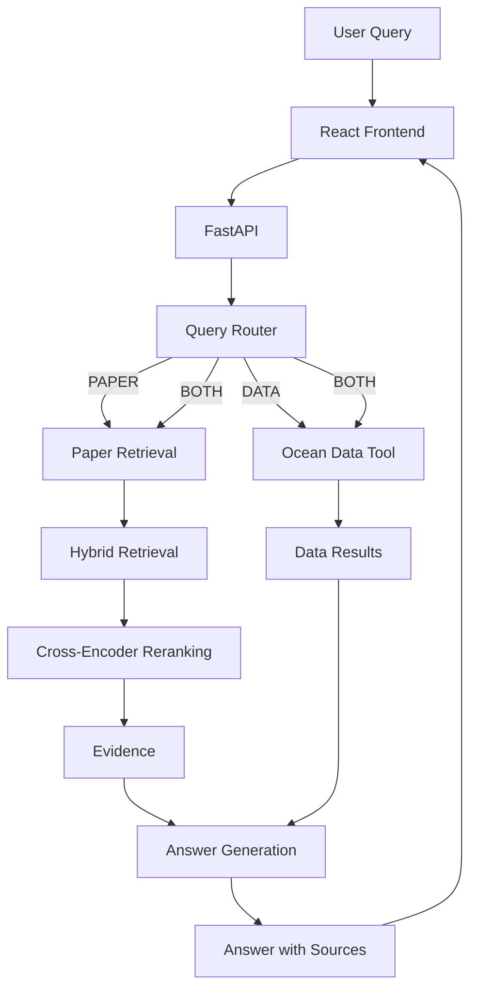

# Agentic Scientific Research Assistant

An agentic research assistant that answers questions about ocean and climate research papers using hybrid retrieval, reranking, and citation-grounded generation. It also supports numerical queries over a structured oceanographic dataset.

## Overview

Scientific research often requires searching across multiple papers, locating relevant evidence, and combining information from different sources. This project explores an AI assistant that automates parts of that workflow.

The system uses an LLM-based router to determine whether a query requires research-paper retrieval, structured data analysis, or both. For paper-based questions, it retrieves relevant passages and reranks them before generating an answer with source references.

### Key Features

* **Agentic query routing:** Classifies questions into paper retrieval, structured data analysis, or combined queries.
* **Hybrid retrieval:** Combines dense vector search and BM25 keyword search using Reciprocal Rank Fusion.
* **Cross-encoder reranking:** Reorders retrieved passages based on their relevance to the query.
* **Grounded answer generation:** Generates responses using retrieved evidence and includes paper/page references.
* **Structured data tool:** Answers numerical questions using a sample oceanographic dataset.
* **FastAPI backend:** Exposes the assistant through an HTTP API.
* **React frontend:** Provides a web interface for submitting questions and viewing answers and evidence.

## Architecture



## Retrieval Pipeline

1. **Document ingestion:** Research PDFs are extracted and processed into text.
2. **Chunking:** Text is divided into overlapping chunks with paper and page metadata.
3. **Dense retrieval:** Sentence-transformer embeddings are used to retrieve semantically relevant passages from ChromaDB.
4. **Keyword retrieval:** BM25 finds passages that match important terms in the query.
5. **Hybrid fusion:** Reciprocal Rank Fusion combines the dense and keyword rankings.
6. **Reranking:** A cross-encoder scores the candidate passages and selects the most relevant evidence.
7. **Answer generation:** The language model uses the selected evidence to produce a response with citations.

## Technology Stack

| Component         | Technology                 |
| ----------------- | -------------------------- |
| Language          | Python                     |
| LLM and routing   | Groq API, Qwen             |
| Embeddings        | Sentence Transformers      |
| Vector database   | ChromaDB                   |
| Keyword retrieval | BM25                       |
| Reranking         | Cross-encoder              |
| Data processing   | pandas                     |
| Backend           | FastAPI                    |
| Frontend          | React, Vite                |
| Evaluation        | Custom evaluation pipeline |

## Research Corpus and Dataset

The research corpus focuses on ocean science, ENSO dynamics, ocean prediction, and sea-surface temperature modeling.

The structured data tool uses a small sample oceanographic dataset containing date, latitude, longitude, depth, temperature, and salinity fields. The sample dataset is intended to demonstrate the data-querying workflow and should not be treated as a comprehensive observational dataset.

Research PDFs and generated vector database files are not included in the repository. Follow the setup instructions and ensure the required local data files are available before running the full system.

## Evaluation

The project was evaluated using a set of 11 test cases.

| Metric                      |        Result |
| --------------------------- | ------------: |
| Test cases completed        |       11 / 11 |
| Route accuracy              |          100% |
| Basic answer/refusal checks |          100% |
| Citation validity           |       73 / 73 |
| Retrieval Hit@1             |         83.3% |
| Retrieval Hit@3             |          100% |
| Retrieval Hit@5             |          100% |
| Mean Reciprocal Rank        |         0.917 |
| Data answer correctness     |         2 / 2 |
| Average latency             | 33.98 seconds |

These results reflect the current evaluation set and test environment. They should not be interpreted as guarantees of performance on arbitrary research questions or larger datasets.

## Project Structure

```text
Agentic-RAG/
├── backend/
│   ├── data/
│   │   ├── ocean/
│   │   ├── papers/
│   │   ├── processed/
│   │   └── vector_db/
│   ├── src/
│   │   ├── agent/
│   │   ├── api/
│   │   ├── data_tools/
│   │   ├── evaluation/
│   │   ├── ingestion/
│   │   └── retrieval/
│   ├── tests/
│   └── requirements.txt
├── frontend/
│   ├── public/
│   └── src/
├── notebooks/
└── README.md
```

## Local Setup

### Prerequisites

* Python 3.12 (or the Python version used to create your environment)
* Node.js and npm
* A Groq API key
* The research PDFs and any required processed data

### 1. Clone the repository

```bash
git clone <YOUR_REPOSITORY_URL>
cd Agentic-RAG
```

### 2. Set up the Python environment

```powershell
python -m venv .venv
.\.venv\Scripts\Activate.ps1
pip install -r backend/requirements.txt
```

### 3. Configure environment variables

Create `backend/.env` and add your API key:

```env
GROQ_API_KEY=your_groq_api_key
```

Do not commit `.env` or expose API keys.

### 4. Prepare the research data

Place the required research PDFs in the expected location under `backend/data/papers/`.

If the processed chunks and vector database are not already available, run the project's ingestion and indexing scripts to generate them. Use the commands and file names defined in the current source code.

### 5. Start the backend

```powershell
cd backend
python -m uvicorn src.api.main:app --reload
```

The API should be available at:

* API: `http://127.0.0.1:8000`
* Interactive API documentation: `http://127.0.0.1:8000/docs`

### 6. Start the frontend

Open a second terminal:

```powershell
cd frontend
npm install
npm run dev
```

Open the local URL printed by Vite in your terminal.

## API

### `GET /`

Returns a basic API response.

### `GET /health`

Checks the API health endpoint.

### `POST /api/query`

Submits a natural-language question to the assistant.

Example request:

```json
{
  "query": "What mechanisms drive ENSO?"
}
```

The response includes the selected route, generated answer, paper evidence, and data evidence where applicable.

## Future Improvements

* Expand the research corpus and evaluate retrieval on a larger, more diverse set of questions.
* Improve latency and measure the contribution of each pipeline stage.
* Add more robust answer-quality and faithfulness evaluation.
* Improve handling of conflicting evidence across papers.
* Deploy the frontend and backend for public access.
* Add user-facing source inspection and richer research workflows.

## License

Add a license if you intend to make the repository open source. If the project is for portfolio demonstration only, specify the intended usage and licensing terms.
