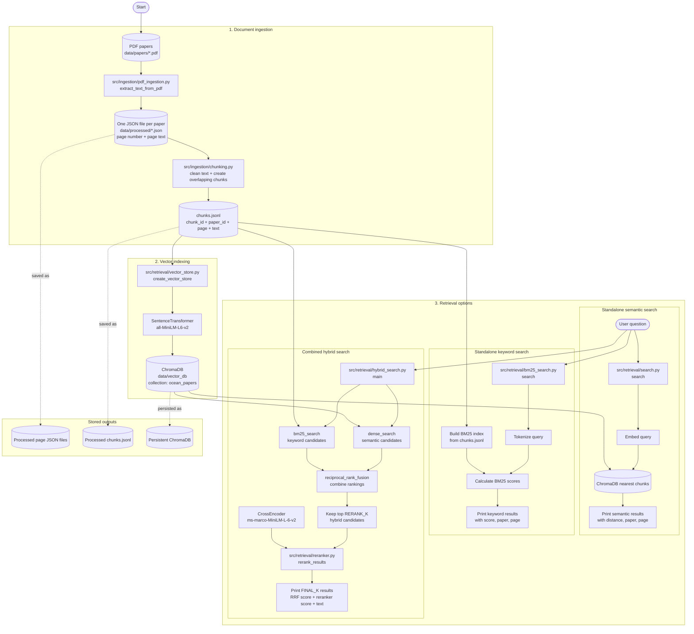
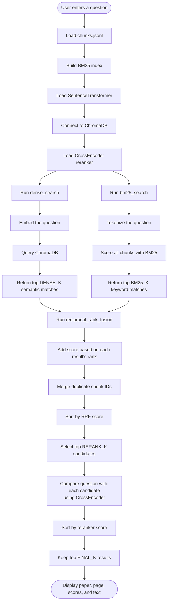

# Agentic RAG: Current Project Flowchart

This diagram shows how the current code in `src/` works from PDF ingestion through retrieval.

## End-to-end architecture

## Hybrid search flow in detail

## What each module does

| Module | Responsibility | Main input | Main output |
|---|---|---|---|
| `ingestion/pdf_ingestion.py` | Extract text page by page from PDFs | PDF files | One JSON file per paper |
| `ingestion/chunking.py` | Clean text and split it into overlapping chunks | Page JSON files | `chunks.jsonl` |
| `retrieval/vector_store.py` | Embed chunks and store them in ChromaDB | `chunks.jsonl` | Persistent vector collection |
| `retrieval/search.py` | Perform semantic-only retrieval | User query + ChromaDB | Nearest chunks |
| `retrieval/bm25_search.py` | Perform keyword-only retrieval | User query + `chunks.jsonl` | BM25-ranked chunks |
| `retrieval/reranker.py` | Score candidate chunks against the query | Query + candidate chunks | Reranked chunks |
| `retrieval/hybrid_search.py` | Combine semantic and keyword retrieval, then rerank | User query + both indexes | Final ranked results |

## Current execution order

Run the scripts in this order when preparing the data:

1. `python src/ingestion/pdf_ingestion.py`
2. `python src/ingestion/chunking.py`
3. `python src/retrieval/vector_store.py`
4. Run one of the search scripts:
   - `python src/retrieval/search.py` for semantic search
   - `python src/retrieval/bm25_search.py` for BM25 search
   - `python src/retrieval/hybrid_search.py` for combined search and reranking

The hybrid search path is currently the most complete retrieval workflow.
